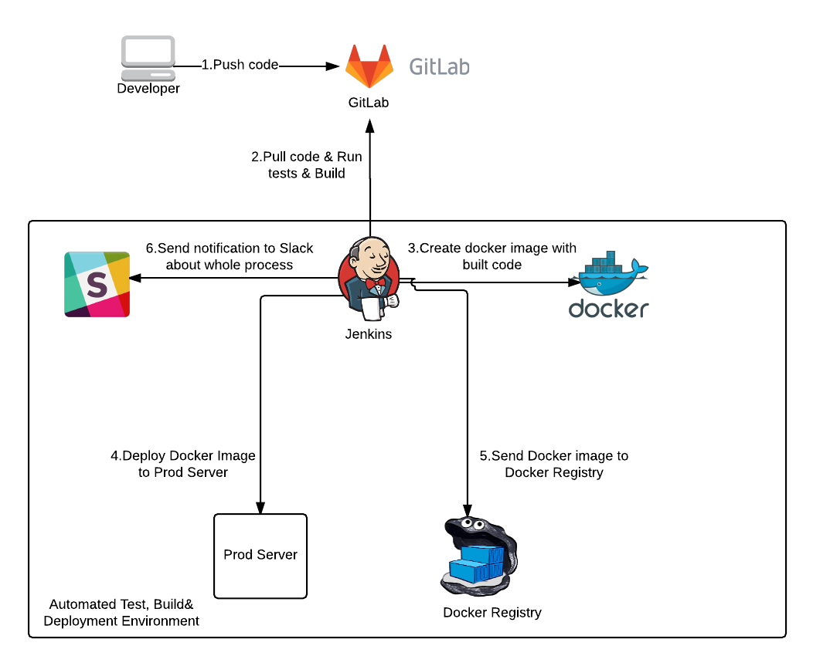

# Jenkins

Integrate Jenkins Pipelines with GitHub!

Jenkins is a powerful and flexible automation tool; It is used to automate almost anything. 

Go faster and learn how to build strong automated processes like Pipelines, CI/CD Workflows and more!

In the DevOps World, Jenkins is one of the best cards on the table. 

If you want to become an expert in the DevOps world, in the course you will learn in addition to Jenkins, crossing technologies that go hand in hand with this service, such as Docker, AWS, Ansible, Git, Maven, DSL, Pipelines and many more!

Start automating everything, and become a DevOps Master!

Are you interested in venturing into a new world full of agile technologies?

